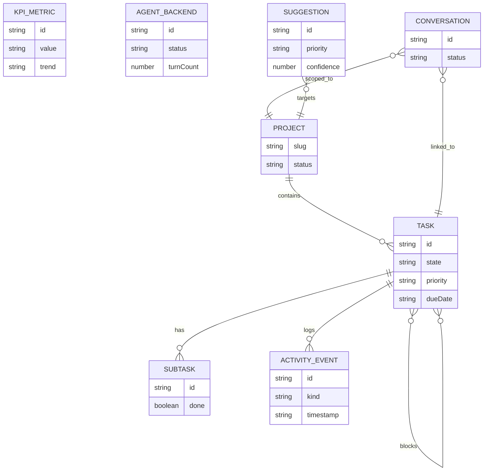
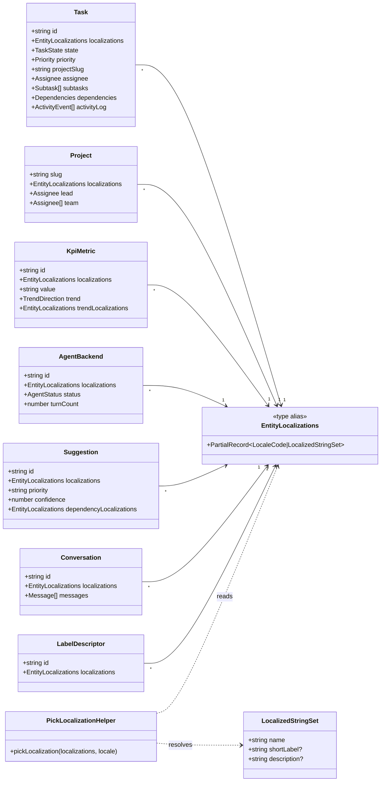

# Data model-driven card architecture

Last updated: 12 March 2026

## Purpose

Every card in the mockup must render from a concrete entity data model
that already contains its localized strings and SI-based measurements.
Locale bundles should keep only UI chrome and formatting scaffolding.
This document defines the schemas, localization rules, and migration
steps for the Corbusier front end.

This architecture applies to all v2a stack front ends. For a
backend-compatible perspective on hexagonal domain boundaries and ports,
see `docs/concept.md`. For the cross-application summary of the shared
card primitives, see `docs/v2a-front-end-stack.md`.

## Principles to enforce

- Entity models own their names, descriptions, badges, and imagery
  per locale.
- Attribute labels come from stable internal identifiers resolved via
  descriptor registries (labels, priorities, states, health statuses).
- Numeric values are stored in SI base units; conversion happens at
  render time via format helpers.
- Counts stay as integers; pluralization belongs to the translation
  system.
- Components receive fully formed entities and only format/present
  them.

## Card inventory and current data sources

- **Dashboard (`dashboard-screen.tsx`)**: system health status panel,
  KPI cards, recent activity feed, agent utilization summary. Data
  comes from `data/dashboard.ts`.
- **My Tasks (`tasks-screen.tsx`)**: filterable task queue with state,
  priority, and project filters. Data from `data/tasks.ts`.
- **Task Detail (`task-detail-screen.tsx`)**: task header, dependency
  hierarchy, state machine controls, subtask checklist, dependency
  panels, branch/PR, activity timeline, metadata panel, related tasks.
- **Task Dependencies (`task-deps-screen.tsx`)**: hierarchy view,
  dependency graph, current task focus.
- **Project List (`projects-screen.tsx`)**: project cards with name,
  lead, date range, status, team avatars.
- **Kanban Board (`kanban-screen.tsx`)**: five columns of task cards
  with punch-card chamfer.
- **Conversation List and Detail**: message timeline, tool execution
  cards, agent status badges, slash-command input, handoff annotations.
- **Directives Registry**: slash command definition cards.
- **AI Suggestions**: suggestion cards with confidence badges, priority
  grouping, AI insights panel.
- **System Pages**: personnel directory, agent backend registry, MCP
  tool registry, hooks & policies, monitoring dashboard, tenant
  management.
- **Settings and Global**: command palette results, notification
  entries, integration cards, user menu.

## Shared model building blocks

Use these primitives across entities:

```ts
export type LocaleCode =
  | "en-GB"
  | "ar"
  | "de"
  | "es"
  | "hi"
  | "ja"
  | "zh-CN";

export type LocalizedStringSet = {
  readonly name: string;
  readonly description?: string;
  readonly shortLabel?: string;
};

export type EntityLocalizations =
  Partial<Record<LocaleCode, LocalizedStringSet>>;

export type LocalizedAltText =
  Partial<Record<LocaleCode, string>>;

export type ImageAsset = {
  readonly url: string;
  readonly alt: LocalizedAltText;
};
```

Fallback rule: prefer the current user locale, fall back to `en-GB`
then any available locale. Components must not construct names from
translation keys. The same fallback chain resolves localized image alt
text when the current locale is absent.

## Entity schemas by card type

### Orchestration domain

- **Task (task cards, Kanban cards, task detail, dependency panels)**
  - `id: TaskId` (e.g. `"TASK-1001"`)
  - `localizations: EntityLocalizations` (name = title, description)
  - `state: TaskState`
  - `priority: Priority`
  - `projectSlug: string`
  - `assignee: Assignee`
  - `dueDate: string` (ISO 8601)
  - `estimate?: string`
  - `labelIds: LabelId[]` (resolved via label descriptor registry)
  - `subtasks: Subtask[]`
  - `dependencies: Dependencies`
  - `branchRef?: string`
  - `pullRequestRef?: string`
  - `activityLog: ActivityEvent[]`
  - `hierarchy: TaskHierarchy`
- **Subtask**
  - `id: string`
  - `localizations: EntityLocalizations` (name = title)
  - `done: boolean`
- **ActivityEvent (activity timeline entries)**
  - `id: string`
  - `kind: EventKind`
  - `timestamp: string` (ISO 8601)
  - `actor: string`
  - `localizations: EntityLocalizations` (name = description)
- **Project (project cards, sidebar entries)**
  - `slug: string`
  - `localizations: EntityLocalizations` (name, description)
  - `lead: Assignee`
  - `dateRange: { start: string; end: string }`
  - `status: "active" | "inactive" | "completed"`
  - `team: readonly Assignee[]`

### Dashboard domain

- **KpiMetric (KPI cards)**
  - `id: string`
  - `localizations: EntityLocalizations` (name = label,
    description = context)
  - `value: string`
  - `trend: TrendDirection`
  - `trendLocalizations: EntityLocalizations` (name = trend label)
- **SystemHealth**
  - `overall: HealthStatus`
  - `lastChecked: string` (ISO 8601)
  - `components: ComponentHealth[]`
- **ComponentHealth**
  - `id: string`
  - `localizations: EntityLocalizations` (name)
  - `status: HealthStatus`
- **AgentBackend (dashboard summary, system registry)**
  - `id: string`
  - `localizations: EntityLocalizations` (name = display name,
    description)
  - `status: AgentStatus`
  - `turnCount: number`
  - `vendor?: string`
  - `version?: string`
  - `capabilities?: string[]`

### Conversation domain

- **Conversation**
  - `id: string`
  - `localizations: EntityLocalizations` (name = title)
  - `taskId: string`
  - `projectSlug: string`
  - `messages: readonly Message[]`
  - `agentBackend: string`
  - `status: "active" | "idle"`
- **Message**
  - `id: string`
  - `role: MessageRole`
  - `content: string` (raw content, not localized)
  - `timestamp: string`
  - `agentBackend?: string`
  - `toolCall?: ToolCallInfo`
- **Directive (slash command definitions)**
  - `id: string`
  - `localizations: EntityLocalizations` (name = command name,
    description)
  - `parameters: DirectiveParameter[]`
  - `template: string`
  - `exampleExpansions: string[]`

### AI domain

- **Suggestion (suggestion cards)**
  - `id: string`
  - `localizations: EntityLocalizations` (name = title,
    description = rationale)
  - `projectSlug: string`
  - `priority: "high" | "medium" | "low"`
  - `confidence: number` (0–100)
  - `categoryTagIds: TagId[]`
  - `dependencyLocalizations: EntityLocalizations`
    (name = context summary)
  - `estimatedDuration: string`
  - `suggestedAssignees: readonly Assignee[]`
- **AiInsight (insight panel bullets)**
  - `id: string`
  - `localizations: EntityLocalizations` (name = observation)
  - `severity: "info" | "warning" | "critical"`

### System administration domain

- **Personnel / User**
  - `id: string`
  - `localizations: EntityLocalizations` (name)
  - `role: "viewer" | "developer" | "team_lead" | "admin"`
  - `assignedTaskCount: number`
  - `lastActive: string` (ISO 8601)
  - `avatar?: ImageAsset`
- **McpServer (tool registry)**
  - `id: string`
  - `localizations: EntityLocalizations` (name, description)
  - `transport: string`
  - `lifecycleState: "registered" | "running" | "stopped"`
  - `healthStatus: HealthStatus`
  - `toolCatalog: McpTool[]`
- **HookDefinition**
  - `id: string`
  - `localizations: EntityLocalizations` (name, description)
  - `triggerType: string`
  - `predicate: string`
  - `actions: string[]`
  - `priority: number`
  - `enabled: boolean`
- **MonitoringMetric**
  - `id: string`
  - `localizations: EntityLocalizations` (name = metric label)
  - `value: number`
  - `unit: string`
  - `threshold?: number`
- **Tenant**
  - `id: string`
  - `localizations: EntityLocalizations` (name = display name)
  - `slug: string`
  - `status: "active" | "suspended"`

### Settings and global domain

- **Notification (bell dropdown entries)**
  - `id: string`
  - `localizations: EntityLocalizations` (name = notification text)
  - `kind: NotificationKind`
  - `timestamp: string` (ISO 8601)
  - `read: boolean`

## Descriptor registries

Descriptors resolve stable internal identifiers to localized display
strings. Each registry entry owns its `localizations`.

- **LabelDescriptor** — `backend`, `agent`, `schema`, `hooks`,
  `policy`, `streaming`, `frontend`, `ui`, `testing`, `devops`,
  `governance`, `dashboard`, `parser`, `security`, `automation`,
  `a11y`, `monitoring`, `settings`.
- **PriorityDescriptor** — `low`, `medium`, `high`, `critical`.
- **TaskStateDescriptor** — `draft`, `in_progress`, `in_review`,
  `paused`, `done`, `abandoned`.
- **HealthStatusDescriptor** — `healthy`, `degraded`, `critical`.
- **AgentStatusDescriptor** — `active`, `inactive`, `error`.
- **EventKindDescriptor** — `state_change`, `subtask_completed`,
  `comment`, `agent_action`, `branch_associated`, `pr_opened`.

## Visual model references

Figure 1 illustrates the entity relationships for the orchestration
domain, mapping how cards compose their data inputs.



Figure 2 sketches the class-level model with localization-aware fields
and asset references that underpin the card architecture.



## Localization handling rules

- Every entity exposes `localizations`; UI selects the matching locale
  once per render using a `pickLocalization(entity, locale)` helper.
- Fluent bundles keep only chrome (button labels, aria labels, section
  headings, format strings with pluralization). Remove entity names,
  descriptions, and state labels from `public/locales/*/common.ftl`
  once migration lands.
- Descriptor registries live in `src/data/registries/` and store
  `localizations` instead of Fluent label keys.
- Component props shift from `title`/`description` strings to entire
  entity objects. Helpers (e.g., `formatTimestamp`) continue to format
  values with translated unit labels.

## Attribute identifier strategy

- Continue to use descriptor ids (`labelId`, `priorityId`, `stateId`)
  as the canonical internal keys.
- The `labelDescriptors` registry resolves task label tags (backend,
  agent, schema, hooks, etc.) to localized display names.
- Status badges, priority tags, and health indicators resolve their
  display strings from the corresponding descriptor registries rather
  than from hard-coded Fluent keys.

## Proposed folder layout

- `src/app/domain/entities/` for TypeScript models and shared helpers
- `src/data/entities/` for fixture instances in the new shape
- `src/data/registries/` for label, state, priority, health, and
  event kind descriptor registries
- `src/app/i18n/` keeps Fluent plumbing; UI chrome strings remain
  there

## Migration roadmap

- **Phase 0: foundations** (first milestone of plan 03)
  - Add shared types (`EntityLocalizations`, `ImageAsset`, locale
    list) and a `pickLocalization` helper with deterministic fallback.
  - Introduce descriptor registries for labels, priorities, states,
    health statuses, and event kinds.
  - Migrate existing plan-02 entities (Task, KpiMetric, AgentBackend,
    DashboardEvent, Subtask) to use `localizations` maps.
  - Move entity strings out of Fluent bundles; keep only UI chrome.
- **Phase 1: projects & kanban** (plan 03, remaining milestones)
  - Create Project entities with localization maps.
  - Kanban columns resolve task localizations via `pickLocalization`.
- **Phase 2: conversations & directives** (plan 04)
  - Conversation and Directive entities with localization maps.
  - Message content stays as raw strings (not localized entity data).
- **Phase 3: AI suggestions** (plan 05)
  - Suggestion and AiInsight entities with localization maps for title,
    rationale, and dependency context.
- **Phase 4: system pages** (plan 06)
  - Personnel, McpServer, HookDefinition, MonitoringMetric, and Tenant
    entities with localization maps.
- **Phase 5: settings & global** (plan 07)
  - Notification entities with localization maps.
  - Settings forms continue to use Fluent for form labels (chrome).
- **Phase 6: hardening**
  - Unit tests for `pickLocalization` fallbacks and descriptor
    resolution.
  - Remove obsolete Fluent keys.
  - Document the final schema in this architecture doc.
