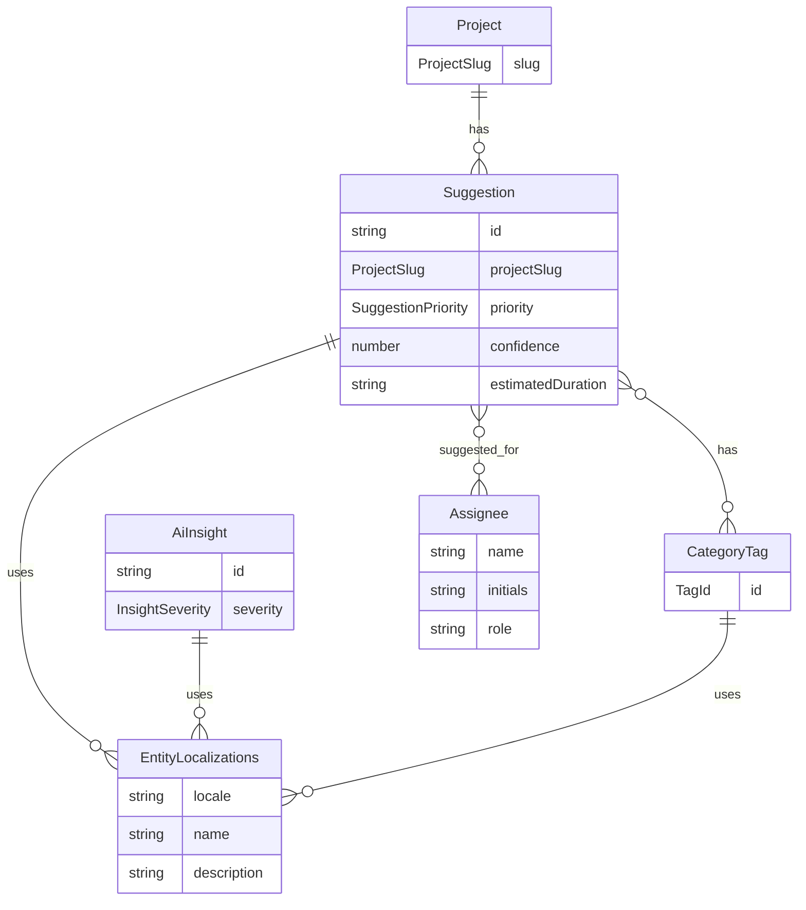
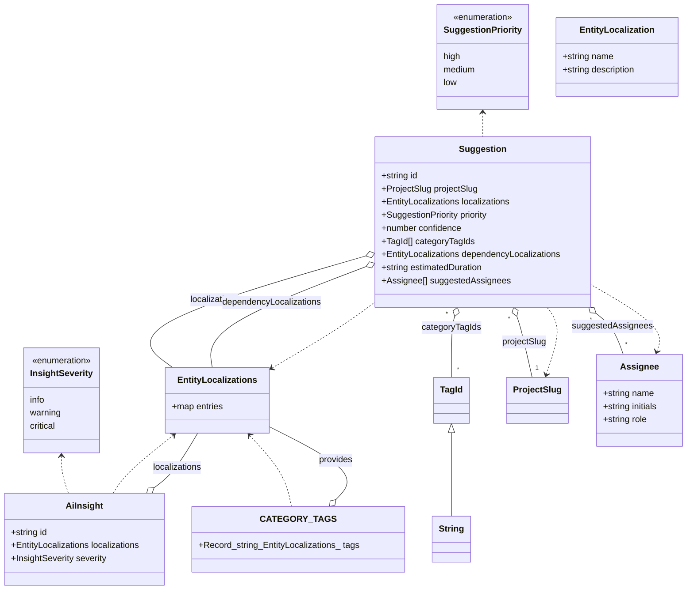

# AI Suggestions

This ExecPlan (execution plan) is a living document. The sections
`Constraints`, `Tolerances`, `Risks`, `Progress`, `Surprises &
Discoveries`, `Decision Log`, and `Outcomes & Retrospective` must be
kept up to date as work proceeds.

Status: COMPLETE

## Purpose / big picture

After this plan is complete, a developer can navigate to:

- **`/suggestions`** — and see the AI Suggestions page: a summary bar
  (analysed items, suggested count, average confidence, last updated),
  project filter tabs, suggestion cards grouped by priority (high,
  medium, low), and an AI Insights panel with bullet observations.

Each suggestion card shows: project badge, category tags, title,
rationale paragraph, dependency context, estimated duration,
confidence percentage (as a circular badge), suggested assignees, and
Dismiss / Add to Backlog action buttons.

This page demonstrates the "human evaluates the recommendation rather
than rubber-stamps it" philosophy described in `docs/concept.md`.

## Constraints

- All constraints from `01-foundation.md` apply (including the
  technology stack section — Tailwind v4, DaisyUI v5, Radix UI, etc.).
- Suggestion cards follow the data-model-driven card architecture
  (`docs/data-model-driven-card-architecture.md`). Use DaisyUI `card`
  and `badge` components for visual presentation.
- Confidence scores must render as circular percentage badges: green
  for ≥90%, amber for 80–89%, grey for <80%.
- Suggestion cards carry the punch-card chamfer (they are moveable
  units of work — the user can add them to the backlog or dismiss
  them).
- The Dismiss and Add to Backlog buttons must be functional in the
  sense that clicking them removes the card from the visible list
  (local state only, no persistence).
- The AI Insights panel uses standard rounded corners (it is an
  informational fixture, not a moveable card).

## Tolerances (exception triggers)

- Scope: if implementation requires more than 10 new files or 1,200
  lines of code (net), stop and escalate.
- Dependencies: no new npm dependencies.
- Iterations: if tests still fail after 3 attempts, stop and
  escalate.

## Risks

- Risk: The circular confidence badge requires a small SVG or CSS
  technique for the percentage arc.
  Severity: low
  Likelihood: certain
  Mitigation: Use a simple circular badge with a DaisyUI radial
  progress pattern or a small inline SVG with a
  `stroke-dasharray`/`stroke-dashoffset` arc. Keep it under 30 lines.

## Progress

- [x] Milestone 1: Suggestion fixture data — `b3adbb0`
- [x] Milestone 2: Suggestion card component — `a25f258`
- [x] Milestone 3: AI Suggestions page — `1ef9655`
- [x] Milestone 4: Tests and validation — `6139114`

## Surprises & discoveries

- Biome `useSemanticElements` rejects `<div role="region">` — must use
  `<section>` instead.
- Biome `useAriaPropsSupportedByRole` rejects `aria-label` on plain
  `<div>` and `<span>` — the assignee avatar stack needed `<fieldset>`
  with `border-none p-0` and individual avatars needed `role="img"`.
- The `loc()` helper from `localization-helpers.ts` only creates en-GB
  entries, so 7-locale translations for fixture data had to be written
  manually (matching the conversations.ts/directives.ts pattern).

## Decision log

- Confidence badge: implemented as inline SVG with
  `stroke-dasharray`/`stroke-dashoffset` arc (26 lines). Used
  `role="img"` with `aria-label` for accessibility.
- Category tags: created a `CATEGORY_TAGS` descriptor registry
  (Record<string, EntityLocalizations>) with 8 tag IDs, rather than
  reusing label descriptors, because tags are suggestion-specific.
- Insights panel severity colours: `bg-error` (critical), `bg-warning`
  (warning), `bg-primary` (info) — follows DaisyUI semantic colour
  tokens.

## Outcomes & retrospective

All 4 milestones delivered. Files created:
- `src/data/suggestions.ts` — 10 suggestions, 6 insights, 8 category
  tags, all with 7-locale translations.
- `src/app/features/suggestions/components/confidence-badge.tsx`
- `src/app/features/suggestions/components/suggestion-card.tsx`
- `src/app/features/suggestions/components/summary-bar.tsx`
- `src/app/features/suggestions/components/insights-panel.tsx`
- `src/app/features/suggestions/suggestions-screen.tsx` (replaced
  placeholder)
- `tests/suggestions-screen.test.tsx` — 9 unit tests
- `tests/e2e/suggestions.pw.ts` — 6 end-to-end (E2E) tests (incl. axe sweep)

All 7 locale Fluent (FTL) files updated with 19 suggestion-related keys each.
`bun run ff` passes with 0 errors: 130 unit tests, 31 E2E tests,
0 axe violations.

## Context and orientation

This plan depends on plans 01 (foundation), 02 (reusable components:
status badges, category tags, avatar stacks), and milestone 0 of
plan 03 (shared localization-aware data model helpers). It is
relatively self-contained because it touches a single route.

The shared data model types (`EntityLocalizations`,
`pickLocalization`, descriptor registries) introduced in plan 03
milestone 0 are used throughout this plan. Entity-owned strings live
in `localizations` maps, not Fluent bundles.

### Key files this plan creates

- `src/data/suggestions.ts` — Fixture data for AI suggestions.
- `src/app/features/suggestions/suggestions-screen.tsx` — The page.
- `src/app/features/suggestions/components/suggestion-card.tsx` — A
  single suggestion card.
- `src/app/features/suggestions/components/confidence-badge.tsx` — A
  circular percentage indicator.
- `src/app/features/suggestions/components/insights-panel.tsx` — The
  AI Insights bullet panel.
- `src/app/features/suggestions/components/summary-bar.tsx` — The
  summary statistics bar.

## Plan of work

### Milestone 1: Suggestion fixture data

Create `src/data/suggestions.ts` defining:

- A `Suggestion` interface with `id`, `projectSlug`,
  `localizations: EntityLocalizations` (name = title,
  description = rationale), `priority` (high/medium/low),
  `confidence` (0–100), `categoryTagIds: TagId[]` (resolved via
  label descriptor registry), `dependencyLocalizations:
  EntityLocalizations` (name = context summary),
  `estimatedDuration`, `suggestedAssignees`.
- 8–10 fixture suggestions spanning all three priority levels and
  multiple projects, with realistic Corbusier-themed content.
- AI insight bullet points (5–6 observations about schedule
  forecasts, blocked-task warnings, and velocity trends).

### Milestone 2: Suggestion card component

Create `src/app/features/suggestions/components/suggestion-card.tsx`:

- A chamfered card showing project badge, category tags, title,
  rationale text, dependency context summary, estimated duration,
  confidence badge, and suggested assignee avatars.
- Two action buttons: "Dismiss" (ghost style) and "Add to Backlog"
  (terracotta action style).
- The confidence badge component
  (`src/app/features/suggestions/components/confidence-badge.tsx`)
  renders a small circle with the percentage number inside and a
  colour ring (green/amber/grey based on threshold).

### Milestone 3: AI Suggestions page

Replace the placeholder. The page renders:

1. **Summary bar** — Four metric tiles: "X items analysed", "Y tasks
   suggested", "Z% average confidence", "Last updated: timestamp".
2. **Project filter tabs** — "All Projects" plus one tab per project
   from fixture data. Clicking a tab filters the suggestion list.
3. **Priority groups** — Three collapsible sections: High Priority,
   Medium Priority, Low Priority. Each section contains suggestion
   cards for that priority level.
4. **AI Insights panel** — A sidebar (or bottom panel on narrow
   viewports) with bullet observations. Uses standard rounded corners
   and the teal accent for bullet markers.

Dismissing or adding a suggestion removes it from the local list
(React state).

### Milestone 4: Tests and validation

- Component test for `SuggestionCard` rendering all fields.
- Component test for `ConfidenceBadge` rendering correct colour for
  each threshold.
- Component test for the suggestions page filtering by project.
- Playwright E2E: navigate to `/suggestions`, verify cards render,
  dismiss a card, verify it disappears.
- Playwright axe sweep.
- `bun run ff` must pass.

## Validation and acceptance

**Quality criteria:**

- Summary bar shows 4 metric tiles.
- Suggestions are grouped by priority with correct card styling.
- Confidence badges show green/amber/grey based on value.
- Dismiss and Add to Backlog buttons remove cards from the list.
- Suggestion cards carry the punch-card chamfer.
- AI Insights panel renders bullet observations.
- All `bun run ff` checks pass.

**Quality method:**

```bash
bun run ff
```

## Idempotence and recovery

Each milestone produces a commit. Retry from last commit on failure.

## Interfaces and dependencies

No new npm dependencies.

### Entity–relationship diagram

*Figure 1: Entity–relationship diagram showing how Suggestion,
AiInsight, CategoryTag, Project, Assignee, and
EntityLocalizations relate. A Project has many Suggestions; each
Suggestion has many CategoryTags and Assignees; Suggestions,
AiInsight records, and CategoryTags each carry EntityLocalizations
for multi-locale display strings.*



### Class diagram

*Figure 2: Class diagram for the AI Suggestions data model. TagId is
a branded string type. SuggestionPriority and InsightSeverity are
union enumerations. Suggestion aggregates EntityLocalizations (for
both its own display strings and dependency context),
ProjectSlug, TagId references, and Assignee records. AiInsight
and the CATEGORY\_TAGS registry also compose EntityLocalizations.
All localisation maps provide per-locale name and description
strings.*



### Key interfaces

In `src/data/suggestions.ts`:

```tsx
export interface Suggestion {
  readonly id: string;
  readonly projectSlug: ProjectSlug;
  readonly localizations: EntityLocalizations;
  readonly priority: "high" | "medium" | "low";
  readonly confidence: number;
  readonly categoryTagIds: readonly TagId[];
  readonly dependencyLocalizations: EntityLocalizations;
  readonly estimatedDuration: string;
  readonly suggestedAssignees: readonly Assignee[];
}

export interface AiInsight {
  readonly id: string;
  readonly localizations: EntityLocalizations;
  readonly severity: "info" | "warning" | "critical";
}
```
