# Corbusier — Front-End Site Map

## Site map diagram

```mermaid
graph TD
    ROOT["Corbusier Web App"]

    %% ── Top-level navigation (MAINFRAME) ──
    ROOT --> DASH["Dashboard"]
    ROOT --> MY_TASKS["My Tasks"]
    ROOT --> AI_SUG["AI Suggestions"]
    ROOT --> PROJECTS["Projects"]
    ROOT --> SYSTEM["System"]
    ROOT --> SETTINGS["Settings"]

    %% ── Dashboard ──
    DASH --> DASH_HEALTH["System Health Overview"]
    DASH --> DASH_KPI["KPI Panels<br/>(SLA, throughput, error rate)"]
    DASH --> DASH_ACTIVITY["Recent Activity Feed"]
    DASH --> DASH_AGENTS["Agent Utilization Summary"]

    %% ── My Tasks ──
    MY_TASKS --> MT_LIST["Task List<br/>(filterable by state, priority, project)"]
    MY_TASKS --> MT_DETAIL["Task Detail View"]
    MT_DETAIL --> MT_META["Task Metadata<br/>(assignee, due date, priority, estimate, labels)"]
    MT_DETAIL --> MT_STATE["State Machine Controls<br/>(transition buttons)"]
    MT_DETAIL --> MT_SUBTASKS["Subtask Checklist"]
    MT_DETAIL --> MT_DEPS["Dependency Panel"]
    MT_DEPS --> MT_DEPS_BLOCKS["Dependencies (Blocks This Task)"]
    MT_DEPS --> MT_DEPS_BLOCKED["Blocked By This Task"]
    MT_DETAIL --> MT_BRANCH["Branch & PR Association"]
    MT_DETAIL --> MT_CONV["Linked Conversation"]
    MT_DETAIL --> MT_AUDIT["Activity Timeline<br/>(audit events, state transitions, comments)"]
    MT_DETAIL --> MT_RELATED["Related Tasks in Same Step"]

    %% ── AI Suggestions ──
    AI_SUG --> AIS_OVERVIEW["Suggestion Overview<br/>(analysed items, suggested count, avg confidence)"]
    AI_SUG --> AIS_FILTER["Project Filter Tabs"]
    AI_SUG --> AIS_HIGH["High Priority Suggestions"]
    AI_SUG --> AIS_MED["Medium Priority Suggestions"]
    AI_SUG --> AIS_LOW["Low Priority Suggestions"]
    AI_SUG --> AIS_INSIGHTS["AI Insights Panel"]
    AIS_HIGH --> AIS_CARD["Suggestion Card<br/>(project, tags, confidence %, rationale,<br/>dependencies, estimate, suggested assignees)"]
    AIS_CARD --> AIS_ADD["Add to Backlog"]
    AIS_CARD --> AIS_DISMISS["Dismiss"]

    %% ── Projects ──
    PROJECTS --> PROJ_LIST["Project List"]
    PROJ_LIST --> PROJ_DETAIL["Project Landing"]
    PROJ_DETAIL --> PROJ_HEADER["Project Header<br/>(lead, date range, status badge, team avatars)"]
    PROJ_DETAIL --> PROJ_VIEWS["View Switcher"]
    PROJ_VIEWS --> PV_BACKLOG["Backlog"]
    PROJ_VIEWS --> PV_KANBAN["Kanban Board"]
    PROJ_VIEWS --> PV_CALENDAR["Calendar"]
    PROJ_VIEWS --> PV_LIST["List View"]
    PROJ_VIEWS --> PV_TIMELINE["Timeline / Gantt"]

    %% ── Kanban Board ──
    PV_KANBAN --> KB_COL["Columns<br/>(To-Do · Planned · In Progress · In Review · Done)"]
    KB_COL --> KB_CARD["Task Card<br/>(priority tag, category tag, title, description,<br/>status, progress %, assignee avatars, task ID)"]
    KB_CARD --> MT_DETAIL
    KB_COL --> KB_NEW["+ Add New (inline card creation)"]

    %% ── Task Dependencies View ──
    PROJ_DETAIL --> PROJ_DEPS["Task Dependencies View"]
    PROJ_DEPS --> DEP_HIERARCHY["Dependency Hierarchy<br/>(Goal → Idea → Step → Task)"]
    PROJ_DEPS --> DEP_CURRENT["Current Task Focus<br/>(progress bar, time spent, subtasks)"]
    PROJ_DEPS --> DEP_GRAPH["Dependency Graph<br/>(blocks / blocked-by)"]
    PROJ_DEPS --> DEP_RELATED["Related Tasks in Same Step"]
    PROJ_DEPS --> DEP_TIMELINE["Activity Timeline"]

    %% ── Conversations ──
    PROJ_DETAIL --> PROJ_CONV["Conversations"]
    PROJ_CONV --> CONV_LIST["Conversation List<br/>(per-task, searchable)"]
    CONV_LIST --> CONV_DETAIL["Conversation Detail"]
    CONV_DETAIL --> CONV_TIMELINE["Message Timeline<br/>(user / assistant / tool / system roles)"]
    CONV_DETAIL --> CONV_TOOL["Tool Execution Log<br/>(inline, expandable result cards)"]
    CONV_DETAIL --> CONV_SLASH["Slash Command Input<br/>(auto-complete, parameter forms)"]
    CONV_DETAIL --> CONV_AGENT["Agent Status Badge<br/>(backend, model, turn progress)"]
    CONV_DETAIL --> CONV_HANDOFF["Handoff Annotations"]

    %% ── Directives (Slash Commands) ──
    PROJ_DETAIL --> PROJ_DIR["Directives<br/>(Slash Command Registry)"]
    PROJ_DIR --> DIR_LIST["Command List<br/>(/task, /review, custom)"]
    PROJ_DIR --> DIR_DETAIL["Command Detail<br/>(parameters, template, example expansions)"]

    %% ── System ──
    SYSTEM --> SYS_PERSONNEL["Personnel"]
    SYS_PERSONNEL --> SYS_USER_LIST["User List"]
    SYS_USER_LIST --> SYS_USER_DETAIL["User Profile<br/>(role, assigned tasks, activity)"]

    SYSTEM --> SYS_REPORTS["Reports"]
    SYS_REPORTS --> RPT_AUDIT["Audit Trail Report"]
    SYS_REPORTS --> RPT_PERF["Performance Report<br/>(agent turns, tool executions, latency)"]
    SYS_REPORTS --> RPT_COMPLIANCE["Compliance Report"]

    SYSTEM --> SYS_AGENTS["Agent Backends"]
    SYS_AGENTS --> AGENT_LIST["Backend Registry<br/>(name, vendor, version, status, capabilities)"]
    AGENT_LIST --> AGENT_DETAIL["Backend Detail<br/>(activate/deactivate, capability flags)"]

    SYSTEM --> SYS_TOOLS["Tool Registry"]
    SYS_TOOLS --> TOOL_MCP["MCP Server List<br/>(name, transport, lifecycle state, health)"]
    TOOL_MCP --> TOOL_MCP_DETAIL["MCP Server Detail<br/>(start/stop controls, tool catalog, health history)"]
    TOOL_MCP_DETAIL --> TOOL_DEF["Tool Definition<br/>(name, description, JSON Schema, access policy)"]

    SYSTEM --> SYS_HOOKS["Hooks & Policies"]
    SYS_HOOKS --> HOOK_LIST["Hook Definitions<br/>(trigger, predicate, actions, priority)"]
    HOOK_LIST --> HOOK_DETAIL["Hook Detail / Editor"]
    SYS_HOOKS --> HOOK_LOG["Hook Execution Log"]

    SYSTEM --> SYS_MONITOR["Monitoring"]
    SYS_MONITOR --> MON_DASH["Operational Dashboard<br/>(Grafana-style metrics panels)"]
    SYS_MONITOR --> MON_ALERTS["Active Alerts"]
    SYS_MONITOR --> MON_HEALTH["Health Checks<br/>(/health/live, /ready, /detailed)"]

    SYSTEM --> SYS_TENANTS["Tenant Management"]
    SYS_TENANTS --> TEN_CURRENT["Current Tenant<br/>(slug, status, owning user)"]

    %% ── Settings ──
    SETTINGS --> SET_PROFILE["User Profile & Preferences"]
    SETTINGS --> SET_AUTH["Authentication & Sessions<br/>(API keys, tokens)"]
    SETTINGS --> SET_WORKSPACE["Workspace Defaults<br/>(encapsulation, resource limits, tool policies)"]
    SETTINGS --> SET_INTEGRATIONS["Integrations"]
    SET_INTEGRATIONS --> INT_VCS["VCS Providers<br/>(GitHub, GitLab — OAuth config, webhooks)"]
    SET_INTEGRATIONS --> INT_REVIEW["Review Integration<br/>(Frankie adapter config)"]
    SETTINGS --> SET_APPEARANCE["Appearance<br/>(theme, density, notification preferences)"]

    %% ── Global elements ──
    ROOT --> GLOBAL_SEARCH["⌘ Search Directives<br/>(global command palette)"]
    ROOT --> GLOBAL_NOTIF["Notifications Bell"]
    ROOT --> GLOBAL_HELP["Help / Docs"]
    ROOT --> GLOBAL_FEEDBACK["Feedback"]

    %% ── Styling ──
    classDef page fill:#FDF6EC,stroke:#C4956A,stroke-width:1px,color:#3D2B1F
    classDef section fill:#F0E6D6,stroke:#B08860,stroke-width:2px,color:#3D2B1F
    classDef action fill:#E8F5E9,stroke:#66BB6A,stroke-width:1px,color:#1B5E20
    classDef global fill:#E3F2FD,stroke:#42A5F5,stroke-width:1px,color:#0D47A1

    class ROOT section
    class DASH,MY_TASKS,AI_SUG,PROJECTS,SYSTEM,SETTINGS section
    class AIS_ADD,AIS_DISMISS,KB_NEW action
    class GLOBAL_SEARCH,GLOBAL_NOTIF,GLOBAL_HELP,GLOBAL_FEEDBACK global
```



## Page inventory

### 1. Dashboard (`/`)

The landing view. Four panels: system health gauges (CPU, memory, DB connections), KPI cards (SLA status, active tasks, agent utilization, tool success rate), a recent activity feed drawn from the domain event stream, and an agent utilization summary showing active backends and turn counts. All panels fed by SSE from `/api/v1/events`.

### 2. My Tasks (`/tasks`)

A personal task queue. Filterable by state (`draft`, `in_progress`, `in_review`, `paused`), priority, and project. Clicking a task opens the **Task Detail View**.

#### 2.1 Task Detail (`/tasks/:id`)

The densest page in the application, corresponding to the Task Dependencies mockup. Structured as:

| Section | Content | Data source |
|---|---|---|
| Header | Title, assignee, due date, priority badge, state badge, Edit Task button | `GET /api/v1/tasks/:id` |
| Dependency Hierarchy | Goal → Idea → Step → Current Task breadcrumb with expand/collapse | Task origin + milestone associations |
| Task Metadata | Assignee, due date, priority, estimate, labels | Task record |
| Progress | Completion %, time spent gauge | Derived from subtask state |
| Subtask Checklist | Ordered subtask list with status icons and active highlight | Child task query |
| Dependencies (Blocks This Task) | Cards for upstream blocking tasks with status, assignee, completion date | `find_by_branch_ref` / dependency graph |
| Blocked By This Task | Cards for downstream blocked tasks | Reverse dependency lookup |
| Related Tasks in Same Step | Sibling task cards with progress bars | Step-scoped query |
| Branch & PR Association | Branch name, PR number, link to VCS | `branch_ref`, `pull_request_ref` |
| State Machine Controls | Buttons for valid transitions only, greyed-out invalid targets | `TaskState::can_transition_to` |
| Activity Timeline | Chronological audit log: state transitions, subtask completions, comments, agent actions | Domain events filtered by `aggregate_id` |

### 3. AI Suggestions (`/suggestions`)

Corresponds to the AI Task Suggestions mockup. An analytical overlay that scans project roadmaps and recommends new tasks.

| Section | Content |
|---|---|
| Summary Bar | Analysed items count, suggested task count, average confidence score, last update timestamp |
| Project Filter Tabs | All Projects, per-project tabs |
| High / Medium / Low Priority Groups | Suggestion cards grouped by inferred priority |
| Suggestion Card | Project badge, category tags (BACKEND, FRONTEND, TESTING, etc.), title, rationale paragraph, dependency context, estimated duration, confidence percentage, suggested assignees, Dismiss / Add to Backlog actions |
| AI Insights Panel | Bullet observations: schedule forecasts, blocked-task warnings, velocity trends |

### 4. Projects (`/projects`)

#### 4.1 Project List (`/projects`)

Card grid of all projects. Each card shows name, lead, date range, status badge (IN-ORBIT, ACTIVE, etc.), team avatar stack.

#### 4.2 Project Landing (`/projects/:slug`)

Corresponds to the Kanban mockup. A tabbed view:

**Backlog** — unscheduled tasks, bulk triage actions.

**Kanban** (`/projects/:slug/kanban`) — columns map directly to `TaskState` values: To-Do (draft), Planned (scheduled), In Progress, In Review, Done. Each card shows priority and category tags, title, short description, status icon, progress bar, assignee avatars, and task ID. Cards are draggable to trigger `transition_task`. Column headers include count badges and "+ Add New" inline creation.

**Calendar** — deadline-centric view, tasks plotted by due date.

**List** — dense tabular view with sortable columns.

**Timeline** — Gantt-style horizontal bar chart of tasks against milestones.

#### 4.3 Task Dependencies (`/projects/:slug/tasks/:id/dependencies`)

The hierarchical dependency view from the first mockup. Accessible from a task card or the task detail page.

#### 4.4 Conversations (`/projects/:slug/conversations`)

Lists conversations scoped to the project's tasks. Clicking opens the **Conversation Detail**.

#### 4.5 Conversation Detail (`/projects/:slug/conversations/:id`)

A chat-style interface:

| Element | Behaviour |
|---|---|
| Message Timeline | Canonical message history, colour-coded by role (user, assistant, tool, system). Tool-call messages show expandable result cards with syntax-highlighted output. |
| Agent Status Badge | Shows active backend name, model identifier, current turn state (idle / processing / awaiting tool result). |
| Slash Command Input | Text input with `/` trigger for auto-complete. Selecting a command expands a parameter form. Submitted commands produce `SlashCommandExpansion` metadata visible in the timeline. |
| Tool Execution Log | Inline cards within the message stream showing `call_id`, `tool_name`, `status`, execution duration. Expandable to full input/output JSON. |
| Handoff Annotations | Visual marker when the agent backend changes mid-conversation, showing the source and target backend with context snapshot link. |

#### 4.6 Directives (`/projects/:slug/directives`)

Browse and manage slash command definitions registered for the project scope. Each entry shows the command name, required/optional parameters, template body, and a "try it" expansion preview.

### 5. System (`/system`)

Administrative and operational pages, gated behind Team Lead / Admin roles.

#### 5.1 Personnel (`/system/personnel`)

User directory. Shows name, role, assigned task count, last active timestamp. User detail shows full activity history and role management controls.

#### 5.2 Reports (`/system/reports`)

Three report categories:

- **Audit Trail** — searchable, filterable event log drawn from `audit_logs` and `domain_events`. Columns: timestamp, tenant, table, operation, user, correlation ID.
- **Performance** — agent turn duration percentiles, tool execution success rates, API latency histograms. Time-range selectable.
- **Compliance** — policy violation summary, hook execution pass/fail rates, data retention status.

#### 5.3 Agent Backends (`/system/agents`)

Registry of agent backends (from `BackendRegistryService`). Each entry shows name, display name, version, vendor, `BackendStatus` (Active/Inactive), capability flags (`supports_streaming`, `supports_tools`). Detail view provides activate/deactivate controls and a capability editor.

#### 5.4 Tool Registry (`/system/tools`)

MCP server management (from `McpServerLifecycleService`). Lists registered servers with name, transport type (stdio/HTTP+SSE), lifecycle state (`registered`/`running`/`stopped`), health status (`healthy`/`unhealthy`/`unknown`), and last health check timestamp. Server detail provides start/stop controls, the tool catalog (output of `tools/list`), and health history. Each tool definition shows name, description, input JSON Schema, and access policy.

#### 5.5 Hooks & Policies (`/system/hooks`)

Hook definition browser and editor. Lists hooks by trigger type, priority, enabled status. Detail view shows trigger configuration, predicate rules, action chain, and a read-only execution log showing recent hook invocations with pass/fail/skip outcomes.

#### 5.6 Monitoring (`/system/monitoring`)

Operational dashboard embedding Grafana-style metric panels: HTTP request rate, agent turn latency (P50/P95/P99), tool execution throughput, database connection pool utilization. Active alerts panel with severity, trigger time, and acknowledgement controls. Health check panel showing endpoint status for `/health/live`, `/health/ready`, `/health/detailed`.

#### 5.7 Tenant Management (`/system/tenants`)

Current tenant details: ID, slug, display name, status, owning user. In the initial single-user-per-tenant model, this is a read-only view with future provisions for team and organization tenant creation.

### 6. Settings (`/settings`)

#### 6.1 Profile & Preferences

User display name, email, avatar, notification preferences.

#### 6.2 Authentication & Sessions

API key management (generate, revoke, last-used tracking). Active session list with device info and revocation.

#### 6.3 Workspace Defaults

Default encapsulation provider, resource limits (CPU, memory, disk, timeout), tool policy (allowed tools, file edit policy: `weaver_only` or `agent_native`).

#### 6.4 Integrations

VCS provider configuration (GitHub/GitLab OAuth credentials, webhook URLs, repository allow-lists). Frankie review adapter connection settings.

#### 6.5 Appearance

Theme toggle (light/dark), layout density, and SSE reconnection preferences.

### 7. Global Elements

| Element | Location | Behaviour |
|---|---|---|
| Search Directives | Header bar, `⌘K` shortcut | Global command palette searching tasks, conversations, slash commands, and projects |
| Notifications Bell | Header bar | Real-time notification count badge; dropdown lists recent events (task assignments, hook failures, PR reviews) |
| User Menu | Header bar, avatar click | Profile link, tenant switcher (future), sign out |
| Help | Header bar, `?` icon | Links to user guide, API docs, keyboard shortcuts overlay |
| Feedback | Footer / sidebar | In-app feedback form |

## Navigation model

The sidebar is persistent across all views:

```
MAINFRAME
  ├─ Dashboard
  ├─ My Tasks
  └─ AI Suggestions

PROJECTS
  ├─ + New Directive (create project)
  ├─ Apollo-Guidance
  ├─ Manhattan-Logistics
  └─ Skunkworks-Alpha

SYSTEM
  ├─ Personnel
  ├─ Reports
  ├─ Agent Backends
  ├─ Tool Registry
  ├─ Hooks & Policies
  ├─ Monitoring
  └─ Tenant Management

──────────
Settings
Feedback
```

Projects in the sidebar use a status indicator (filled circle = active, hollow = inactive). The currently selected project/page is highlighted. Project entries expand on click to reveal that project's sub-navigation (Kanban, List, Calendar, Timeline, Conversations, Directives).

## Route table

| Route | Page | Auth required | Min role |
|---|---|---|---|
| `/` | Dashboard | Yes | Viewer |
| `/tasks` | My Tasks | Yes | Developer |
| `/tasks/:id` | Task Detail | Yes | Developer |
| `/suggestions` | AI Suggestions | Yes | Developer |
| `/projects` | Project List | Yes | Viewer |
| `/projects/:slug` | Project Landing (Kanban default) | Yes | Viewer |
| `/projects/:slug/kanban` | Kanban Board | Yes | Viewer |
| `/projects/:slug/backlog` | Backlog | Yes | Developer |
| `/projects/:slug/calendar` | Calendar View | Yes | Viewer |
| `/projects/:slug/list` | List View | Yes | Viewer |
| `/projects/:slug/timeline` | Timeline View | Yes | Viewer |
| `/projects/:slug/tasks/:id` | Task Detail (project-scoped) | Yes | Developer |
| `/projects/:slug/tasks/:id/dependencies` | Task Dependencies | Yes | Developer |
| `/projects/:slug/conversations` | Conversation List | Yes | Developer |
| `/projects/:slug/conversations/:id` | Conversation Detail | Yes | Developer |
| `/projects/:slug/directives` | Slash Command Registry | Yes | Developer |
| `/system/personnel` | Personnel | Yes | Team Lead |
| `/system/personnel/:id` | User Profile | Yes | Team Lead |
| `/system/reports` | Reports | Yes | Team Lead |
| `/system/agents` | Agent Backends | Yes | Admin |
| `/system/agents/:id` | Backend Detail | Yes | Admin |
| `/system/tools` | Tool Registry | Yes | Admin |
| `/system/tools/:id` | MCP Server Detail | Yes | Admin |
| `/system/hooks` | Hooks & Policies | Yes | Team Lead |
| `/system/hooks/:id` | Hook Detail | Yes | Team Lead |
| `/system/monitoring` | Monitoring Dashboard | Yes | Team Lead |
| `/system/tenants` | Tenant Management | Yes | Admin |
| `/settings` | Settings (Profile) | Yes | Viewer |
| `/settings/auth` | Authentication & Sessions | Yes | Viewer |
| `/settings/workspace` | Workspace Defaults | Yes | Developer |
| `/settings/integrations` | Integrations | Yes | Admin |
| `/settings/appearance` | Appearance | Yes | Viewer |

## Real-time data requirements

Every page that shows live state subscribes to the SSE endpoint at `/api/v1/events`. The front-end event stream manager filters by event type and resource scope:

| Page | Event types consumed | Scope filter |
|---|---|---|
| Dashboard | All system events | Tenant-wide |
| My Tasks | `TaskStateTransition`, `TaskAssigned` | Current user |
| Kanban Board | `TaskStateTransition`, `TaskCreated` | Current project |
| Task Detail | `TaskStateTransition`, `SubtaskCompleted`, `CommentAdded` | Specific task |
| Conversation Detail | `TurnStarted`, `ToolCallInitiated`, `ToolExecutionComplete`, `TurnCompleted`, `Error` | Specific conversation |
| Monitoring | `HealthCheck`, `AlertTriggered`, `AlertResolved` | Tenant-wide |

## Design system notes

The mockups establish a warm, mid-century-tinged palette consistent with the Corbusier namesake:

- **Primary accent**: Coral/terracotta (`~#E07A5F`) for active states, status badges, CTAs
- **Surface**: Warm off-white (`~#FDF6EC`) backgrounds, not stark white
- **Cards**: Soft cream with subtle warm-grey borders, generous padding
- **Typography**: Monospace for IDs and code (`TASK-892`, `STEP-117`); humanist sans-serif for body; condensed uppercase for section labels (`MAINFRAME`, `PROJECTS`, `SYSTEM`)
- **Status colours**: Green (completed), coral (in progress/active), amber (pending/blocked), red (critical/blocked)
- **Avatar treatment**: Overlapping circular stacks with ring borders
- **Confidence scores**: Circular percentage badges (green ≥90%, amber 80–89%, grey <80%)
